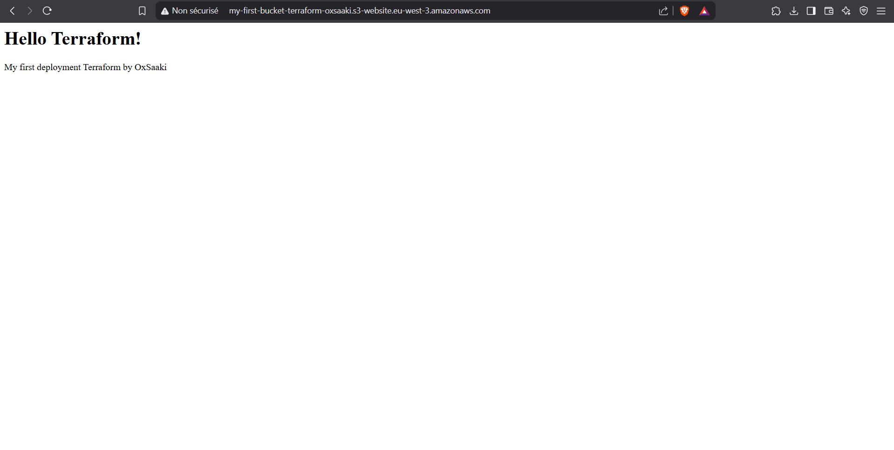

# AWS S3 Static Site with Terraform

This project is my first infrastructure deployment with Terraform. It creates a static website hosted on AWS S3.

## Features

- S3 Bucket configured for static web hosting
- Simple HTML pages (index and error)
- CORS configuration
- Public access policy to allow browsing

## Screenshots

## Deployed infrastructure

- S3 bucket for web hosting
- Static web hosting configuration
- Public access policy
- Basic HTML files

## Technologies used

- Terraform
- AWS S3
- AWS IAM

## How to use this project

1. Clone the repository
2. Configure AWS credentials
3. Run `terraform init`.
4. Run `terraform apply`

## Learnings

I learned a lot from this project:
- Terraform basics (init, plan, apply)
- AWS resource creation via IaC
- AWS permissions and error handling
- Best practices for static hosting

